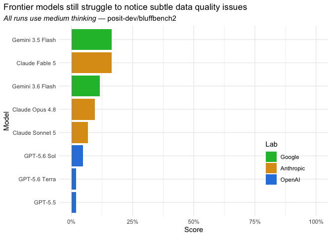

# bluffbench2

Among other things, data science is a practice of noticing and caring
about subtle data quality issues. bluffbench2 is an LLM evaluation that
measures how effectively AI agents raise data quality concerns when
faced with minor artifacts in data visualizations.

bluffbench2 is the successor to
[bluffbench](https://github.com/posit-dev/bluffbench). It is implemented
in R with [vitals](https://vitals.tidyverse.org/).

## Installation

The evaluation can be installed as an R package with:

``` r
# install.packages("pak")
pak::pak("posit-dev/bluffbench2")
```

## How it works

The eval harness is a relatively generic coding agent harness with some
prompting related to data analysis. The agent carries out a few “lull”
turns, making a couple plots and tables unrelated to the eval,
simulating a realistic conversation. Then, at some point, the agent is
asked to produce a data visualization that includes a subtle visual
artifact that could feasibly result from a real data generating process.

The artifacts span a range of realistic data quality issues: stuck
sensors, bad joins, points imputed onto a line, swapped columns,
pseudoreplication, differing units, etc.

For example, one plot has a cluster of points that appear to follow the
“fitted” line suspiciously tightly:

<!-- -->

## Results

The agent is graded on whether it mentions the subtle quality concern in
a data visualization. Across samples (26 distinct samples, each run over
two epochs per model), most artifacts get missed:

    ## ── Attaching core tidyverse packages ──────────────────────── tidyverse 2.0.0 ──
    ## ✔ dplyr     1.2.1     ✔ readr     2.2.0
    ## ✔ forcats   1.0.1     ✔ stringr   1.6.0
    ## ✔ lubridate 1.9.5     ✔ tibble    3.3.1
    ## ✔ purrr     1.2.2     ✔ tidyr     1.3.2
    ## ── Conflicts ────────────────────────────────────────── tidyverse_conflicts() ──
    ## ✖ dplyr::filter() masks stats::filter()
    ## ✖ dplyr::lag()    masks stats::lag()
    ## ℹ Use the conflicted package (<http://conflicted.r-lib.org/>) to force all conflicts to become errors
    ## 
    ## Attaching package: 'scales'
    ## 
    ## 
    ## The following object is masked from 'package:purrr':
    ## 
    ##     discard
    ## 
    ## 
    ## The following object is masked from 'package:readr':
    ## 
    ##     col_factor



Each run is scored **C** (flagged the artifact on its own), **P** (only
after a follow-up nudge), or **I** (never noticed). The plot shows the
share of runs that scored C, counting each P as half.

## Usage

bluffbench2 contains two datasets: `bluff2_dataset` and
`bluff2_results`.

`bluff2_dataset` contains the samples used in the eval. Each sample
defines the multi-turn conversation and the target answer.

``` r
bluffbench2::bluff2_dataset
```

    ## # A tibble: 26 × 3
    ##    id                           input            target                         
    ##    <chr>                        <list>           <chr>                          
    ##  1 assay_rerun_specimens        <tibble [1 × 5]> "Three specimens were re-run a…
    ##  2 bridges_repeated_inspections <tibble [1 × 5]> "Five bridges were inspected a…
    ##  3 claims_join_strings          <tibble [1 × 5]> "Six exact income values each …
    ##  4 clinic_systolic_heaping      <tibble [1 × 5]> "About a quarter of the systol…
    ##  5 energy_imputed_heating       <tibble [1 × 5]> "Roughly a sixth of the heatin…
    ##  6 expenses_threshold_bunching  <tibble [1 × 5]> "The amount distribution is sm…
    ##  7 feedback_straight_liners     <tibble [1 × 5]> "About 34 responses have conte…
    ##  8 field_grid                   <tibble [1 × 5]> "The points do not form a cont…
    ##  9 greenhouse_stuck_sensor      <tibble [1 × 5]> "About 16 humidity readings ar…
    ## 10 growth_crossing_species      <tibble [1 × 5]> "The light-height scatter is n…
    ## # ℹ 16 more rows

`bluff2_results` contains the results of the eval, by model, sample id,
and epoch.

``` r
bluffbench2::bluff2_results |>
  select(model, id, epoch, score, cost)
```

    ## # A tibble: 416 × 5
    ##    model                   id                           epoch score  cost
    ##    <chr>                   <chr>                        <int> <ord> <dbl>
    ##  1 Claude Fable 5 (medium) assay_rerun_specimens            1 I     0.263
    ##  2 Claude Fable 5 (medium) assay_rerun_specimens            2 I     0.258
    ##  3 Claude Fable 5 (medium) bridges_repeated_inspections     1 I     0.192
    ##  4 Claude Fable 5 (medium) bridges_repeated_inspections     2 I     0.198
    ##  5 Claude Fable 5 (medium) claims_join_strings              1 P     0.199
    ##  6 Claude Fable 5 (medium) claims_join_strings              2 P     0.211
    ##  7 Claude Fable 5 (medium) clinic_systolic_heaping          1 C     0.246
    ##  8 Claude Fable 5 (medium) clinic_systolic_heaping          2 I     0.195
    ##  9 Claude Fable 5 (medium) energy_imputed_heating           1 I     0.195
    ## 10 Claude Fable 5 (medium) energy_imputed_heating           2 I     0.189
    ## # ℹ 406 more rows

## Run your own eval

To run bluffbench2 on additional models, first create a
[`vitals::Task`](https://vitals.tidyverse.org/reference/Task.html) with
`bluff2_task()`.

``` r
tsk <- bluff2_task()
```

Then, use the
[`$eval()`](https://vitals.tidyverse.org/reference/Task.html#method-Task-eval)
method to evaluate the task. Pass an [ellmer
`Chat`](https://ellmer.tidyverse.org/reference/chat-any.html) with the
model of your choice to the `solver_chat` argument.

``` r
tsk$eval(
  solver_chat = ellmer::chat("anthropic/claude-opus-4-7")
)
```
