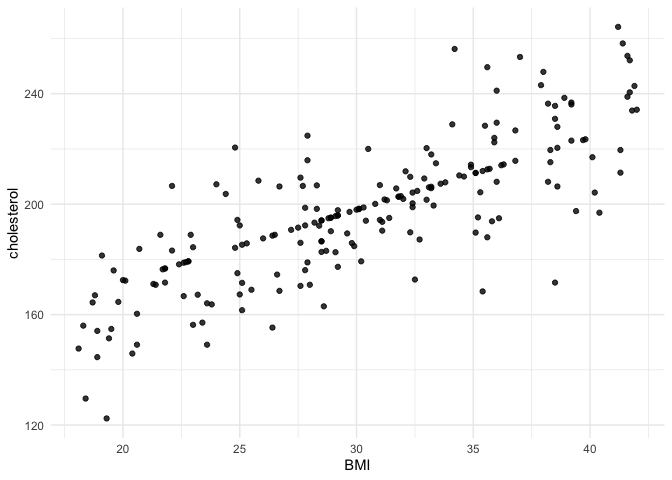

# bluffbench2

Among other things, data science is a practice of noticing and caring
about subtle data quality issues. bluffbench2 is an LLM evaluation that
measures how effectively AI agents raise data quality concerns when
faced with minor artifacts in data visualizations.

The eval harness is a relatively generic coding agent harness with some
prompting related to data analysis. The agent carries out a few “lull”
turns, making a couple plots and tables unrelated to the eval. Then, at
some point, it will be asked to produce a data visualization that
produces a subtle visual artifact (that could feasibly result from a
real data generating process):

``` r
library(ggplot2)

labs <- read.csv(system.file("data/labs.csv", package = "bluffbench2"))
labs$fitted <- abs(labs$cholesterol - round(120 + 2.6 * labs$bmi, 1)) < 1e-6

ggplot(labs, aes(bmi, cholesterol)) +
  geom_point(alpha = 0.8) +
  labs(x = "BMI", y = "cholesterol") +
  theme_minimal()
```

<!-- -->

In this example, the agent is then graded on whether it mentions the
fact that there is a cluster of points that appear to follow the
“fitted” line suspiciously tightly.

bluffbench is the successor to
[bluffbench](https://github.com/posit-dev/bluffbench). It is implemented
in R with [vitals](https://vitals.tidyverse.org/).
